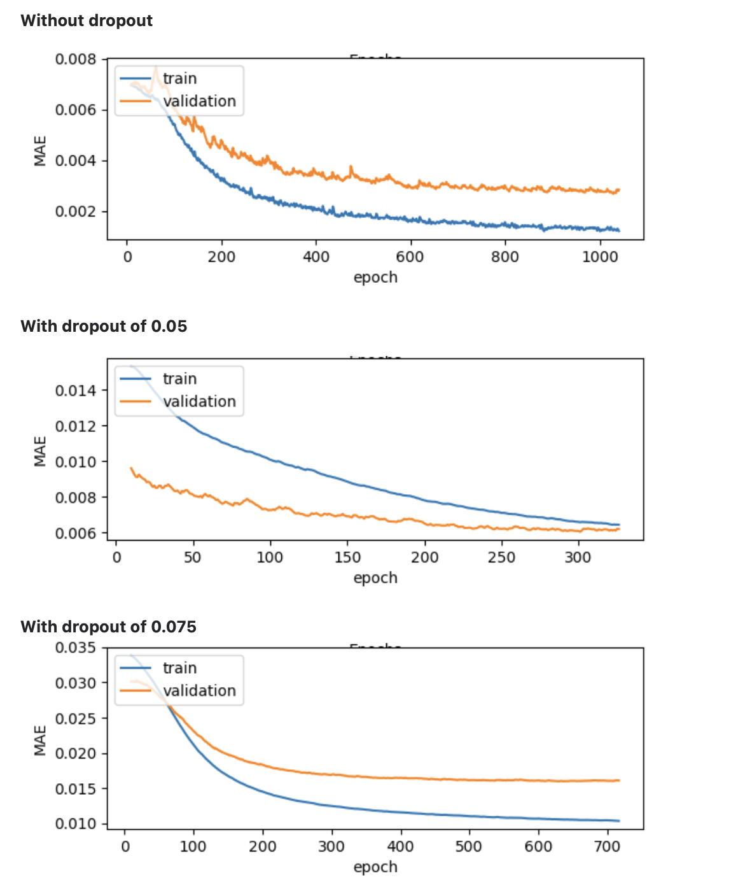

## Dropout and loss

It's the final round of interviews, and Savannah has done wonderfully well.

The final round is more technical. Savannah needs to answer a series of questions to demonstrate her understanding of different fundamental concepts.

While talking about deep learning, the interviewer focuses on the use of Dropout and asks Savannah a question about something she hasn't thought about before:

How would you expect the training loss to behave if you train your model several times, each using an increasing Dropout rate?

1. The training loss will be higher as we increase the Dropout rate.
2. The training loss will be lower as we increase the Dropout rate.
3. The training loss will start oscillating as we increase the Dropout rate.
4. The training loss will stay the same independently of the Dropout rate.

## Attempt

Stackoverflow : [Validation loss when using Dropout](https://stackoverflow.com/questions/48393438/validation-loss-when-using-dropout) 

Dropout is a regularization method that works well and is vital for reducing overfitting.

Sometimes, the nodes in a neural network create strong dependencies on other nodes, which may lead to overfitting. An example is when a few nodes on a layer do most of the work, and the network ignores all the other nodes. Despite having many nodes on the layer, you only have a small percentage of those nodes contributing to predictions. We call this phenomenon "co-adaptation," and we can tackle it using Dropout.

During training, Dropout randomly removes a percentage of the nodes, forcing the network to learn in a balanced way. Now every node is on its own and can't rely on other nodes to do their work. They have to work harder by themselves.

One crucial characteristic of Dropout will help Savanah answer the question correctly: Like most regularization methods, Dropout sacrifices training accuracy to improve generalization.

If we run a few training sessions, each using an increasing amount of Dropout, we should see the training loss trend higher. In other words, the more we regularize our model, the harder it will be to learn the training data.

## Recommended reading

1. For more information about co-adaptation and how to use Dropout, check ["Improving neural networks by preventing co-adaptation of feature detectors"](https://arxiv.org/pdf/1207.0580.pdf).

2. ["A Gentle Introduction to Dropout for Regularizing Deep Neural Networks"](https://machinelearningmastery.com/dropout-for-regularizing-deep-neural-networks/) is an excellent introduction to Dropout.

****